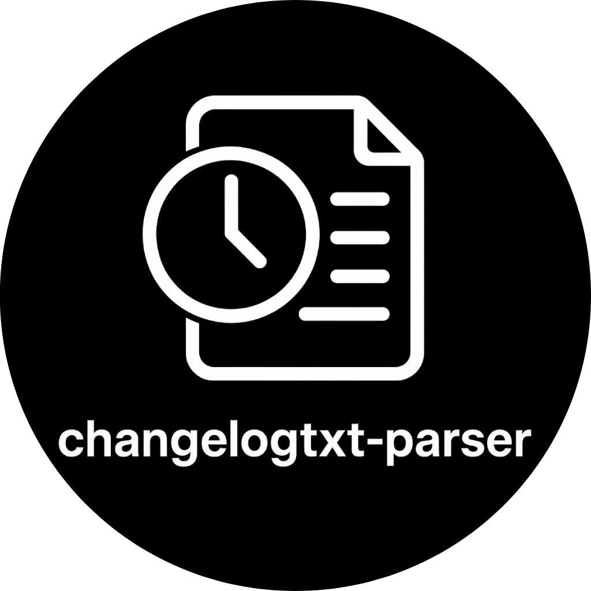

# Changelogtxt-parser

<h1 align="center">
	
</h1>

## Overview

Changelogtxt-parser is a lightweight Python utility designed to help you manage changelog files. It offers a command-line interface (CLI) that can:

- Check if a tag exists.
- Check the changelog format.
- Compare two changelog files.
- Add a new tag.
- Add a new unreleased entry.

### CHANGELOG.txt format

The format expected is each version proceede by a v:

```txt
v1.02
v0.40
```

where each version number is either semvar or python packaging (can be adjusted by strictness).

Actual changelog entries should be a dash-bulleted list of points. Here is a valid example:

```txt
- This is an unreleased point
v1.02
v1.02rc0
- This is where we aded something
  and it is multi-line to boot!
```

## Use in github actions

```yml
- name: Changelog check
  id: changelog
  uses: geopozo/changelogtxt-parser@main
  with:
    working-directory: ./src/py
    tag-check: tag-pushed o algo? (o string)
    summarize-news: pr-to-default (algo mas facil?) . main:src/py/ <-- como se especifica in git
```
mangers de escribir rutas
path:
branch:path
repo:branch:path
repo:path ? (no, se puede confunidr on branch:path
o

path
@branch:path
repo@branch:path
repo:path <-- usa default


## Installation

You can use Changelogtxt-parser in two ways:

1. Install in your project:

<div class="termy">

```console
uv add git+https://github.com/geopozo/changelogtxt-parser
```

</div>

After installation, verify that it’s working by running:

<div class="termy">

```console
uv run changelogtxt --help
```

</div>

2. From source using uvx (recommended for latest version):

<div class="termy">

```console
uvx --from git+https://github.com/geopozo/changelogtxt-parser changelogtxt --help
```

</div>

## Using Changelogtxt-parser

<div class="termy">

```console
usage: changelogtxt [-h] [--logistro-human]
[--logistro-structured] [--logistro-level LOG]
{check-tag,check-format,summarize-news,update} ...

changelogtxt helps you manage your changelog file.
changelogtxt COMMAND --help for information about commands.

positional arguments:
  {check-tag,check-format,summarize-news,update}
    check-tag           Checks if a tag in the changelog
                        matches the specified tag.
    check-format        Check changelog format.
    summarize-news      Compare source file with target file.
    update              Creates a new version entry if it
                        doesn't exist.

options:
  -h, --help            show this help message and exit
  --logistro-human      Format the logs for humans
  --logistro-structured
                        Format the logs as JSON
  --logistro-level LOG  Set the logging level (no default,
                        fallback to system default)
```

</div>

## License

This project is licensed under the terms of the MIT license.
